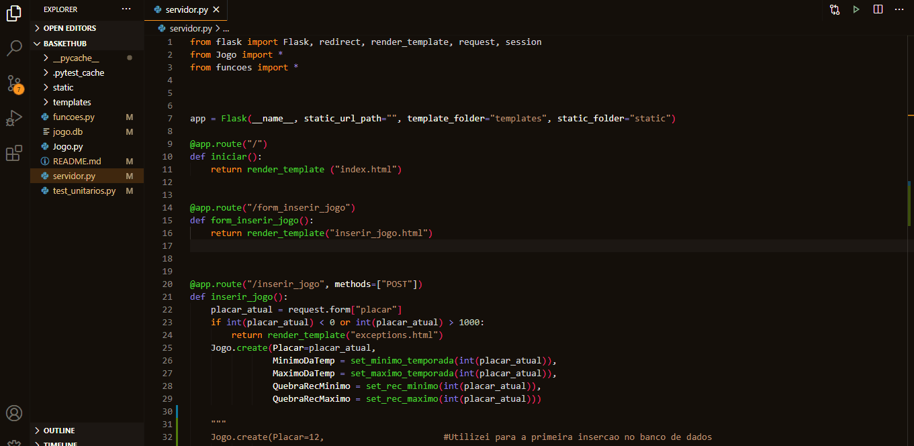
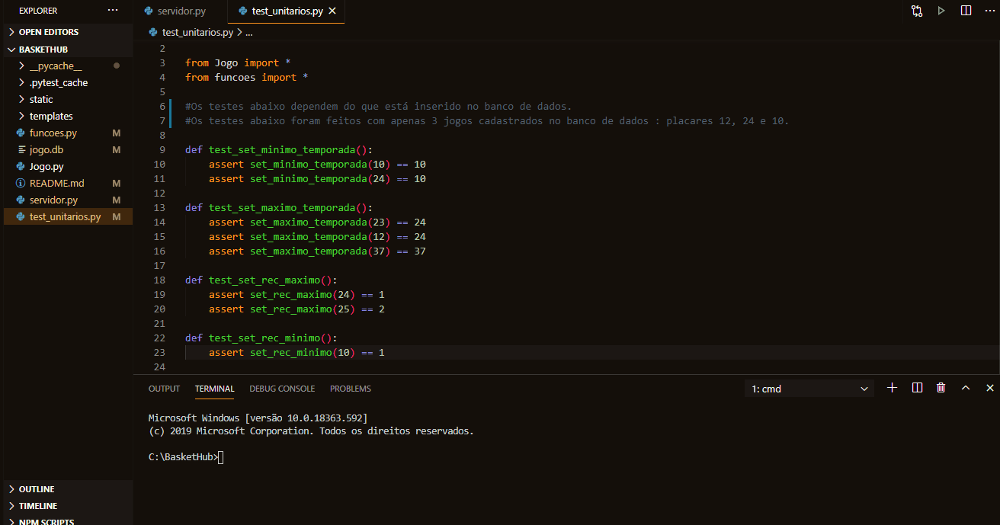
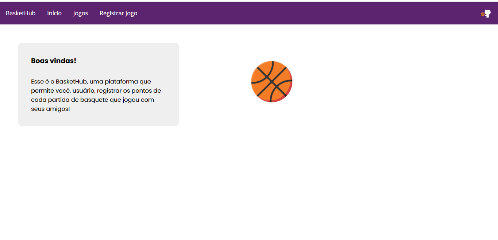
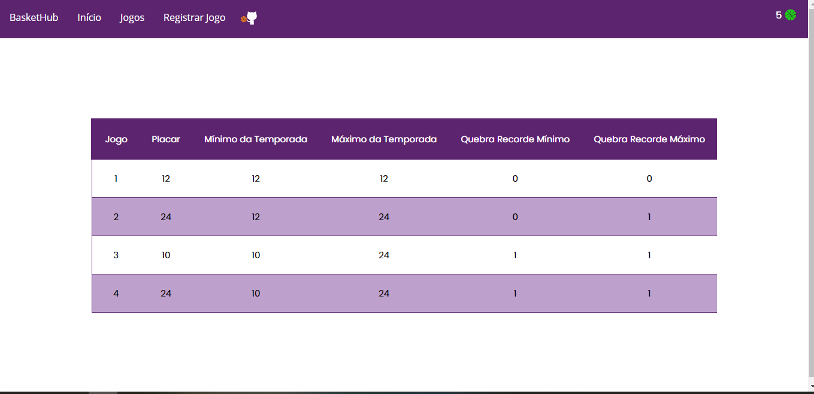
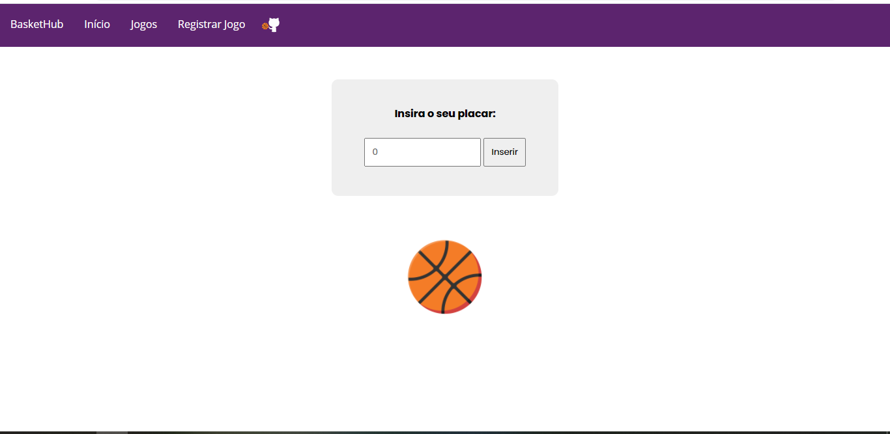
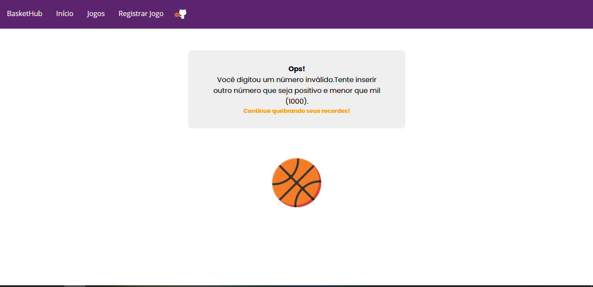

# QuestaoPratica

## Bem vindo ao BasketHub! 

### O BasketHub é uma plataforma feita para auxiliar o usuário a acompanhar seus registros de pontuação de cada partida de basquete que jogou com seus amigos! 

## Tecnologias Utilizadas 
Python
Flask
Peewee
HTML
CSS

## Instalações 

Instalar a linguagem de programação Python <strong>(incluindo o pip)</strong> - https://www.python.org/downloads/ 

Instalar um editor de código-fonte (Visual Studio Code) - https://code.visualstudio.com/download

No Visual Studio Code, ir em Terminal - Novo Terminal e digitar : 

pip install flask 

pip install peewee 

pip install pytest 

## Rodar o Projeto 

 Ir no arquivo servidor.py, clicar com o botão direito do mouse no editor, e clicar em Run Python File in Terminal 

Após isso, irá aparecer uma rota no terminal : 127.0.0:5000 

CTRL + Clique com o botão esquerdo do mouse

A aplicação irá abrir na web

 <strong> Clique em Registrar Jogo, então, será redirecionado(a) para a interface de consulta de dados</strong>

<strong> Dessa forma, poderá continuar registrando os jogos e acompanhando as pontuações</strong>

## Testes unitários 

Para rodar os testes unitários, é necessário encerrar a aplicação e abrir um novo terminal.

Após abrir esse novo terminal, digitar :  python -m pytest 

## Destaques

O BasketHub tem uma "moeda" local chamada BasketCoin. Irá aparecer no canto superior direito da tela se: 

O Recorde Máximo > 0 e < 3 : 5 BasketCoins 

O Recorde Máximo > 2 e < 6 : 10 BasketCoins

O Recorde Máximo > 5 : 20 BasketCoins 

### ! IMPORTANTE : O banco de dados (jogo.db) do último commit que está aqui no projeto não deve ser apagado
### Ele deve ser utilizado para todo o processo de inserção e consultas no banco de dados. 

## Imagens 

